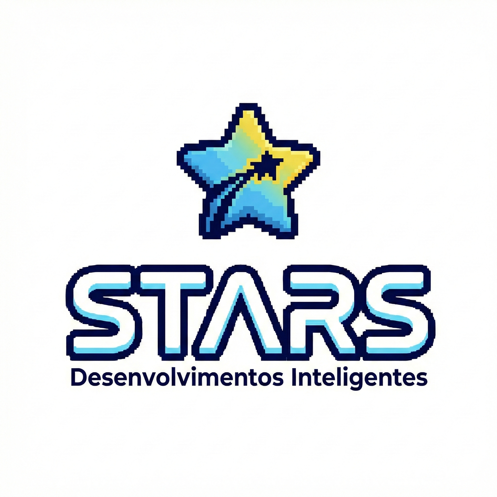

# Assistente STARSdevbr do Projeto Extremamente Aesthetic ;)

## 📒 Descrição
A jornada visual da STARS Desenvolvimentos Inteligentes ganhou um rosto de forma inusitada e muito carismática. Precisávamos de uma identidade para o nosso assistente virtual, o bot do Telegram que atua na linha de frente das nossas automações e interações. Foi então que, utilizando o modelo de geração de imagens Nano Banana, demos vida ao nosso mascote. O design do personagem em formato de banana não foi por acaso: é uma homenagem bem-humorada e direta à própria inteligência artificial que ajudou a materializá-lo, unindo tecnologia de ponta com um toque de personalidade única, amigável e "felomenal".

O mais fascinante desse processo criativo foi como uma ideia puxou a outra de forma totalmente orgânica. Ao analisar o primeiro conceito do nosso simpático robô, um detalhe específico chamou a atenção: o design do uniforme que ele vestia. O emblema no peito, com uma estrela estilizada e uma tipografia moderna, capturava perfeitamente a essência disruptiva e tecnológica que queríamos para a empresa. A partir dessa observação, isolamos e refinamos aquele recorte, transformando-o na marca oficial da STARS. A logo corporativa nasceu do próprio assistente.

Com a identidade estática consolidada, o passo seguinte foi dar vida e movimento à marca. Utilizando o poderoso modelo de vídeo Veo, transformamos os pixels estáticos em animações cinematográficas. A logo ganhou um pulso de luz neon e um reflexo metálico que transmitem velocidade e processamento de dados, elevando o profissionalismo da apresentação da marca para um novo patamar, pronta para o mercado.

Olhando para todo esse processo, fica claro que a verdadeira inovação não exige orçamentos colossais, mas sim engenhosidade e as ferramentas certas. Ver uma identidade visual de alto nível nascer de um prompt e ser animada por inteligência artificial — tudo isso para representar um robusto laboratório de automação self-hosted que roda bravamente em um modesto Raspberry Pi 3 — é a prova definitiva do nosso método de trabalho. Estamos construindo um ecossistema gigante e inteligente, sempre no ritmo "certificado e tartarugado", provando que a otimização supera a força bruta.

## 🤖 Tecnologias Utilizadas
* **Gemini 3.1 Pro:** Utilizado como co-piloto para ideação, engenharia de prompts e estruturação do storytelling do projeto.
* **Modelo Nano Banana (Google):** IA generativa de imagens utilizada para criar o design 3D do avatar (text-to-image) e, posteriormente, para isolar e refinar a logo corporativa identificada no uniforme do mascote.
* **Modelo Veo (Google):** IA generativa de vídeo utilizada para a etapa de *Image-to-Video*, transformando a logo estática em uma animação cinematográfica de alta fidelidade.
* **n8n & Telegram API:** O ecossistema de destino onde o avatar atua como assistente virtual automatizado.

## 🧐 Processo de Criação
O processo foi conduzido de forma iterativa, focando na extração de valor em cada etapa:
1.  **Idealização:** O ponto de partida foi um prompt detalhado focado em criar um robô 3D carismático em formato de banana para o Telegram.
2.  **Curadoria "Natty":** Ao invés de apenas aceitar a primeira imagem, o olhar humano foi fundamental para identificar um elemento secundário gerado pela IA (a estampa do casaco) e perceber seu potencial como identidade corporativa.
3.  **Desmembramento:** Solicitamos a geração de uma nova imagem quadrada isolando apenas a logo, garantindo o formato ideal para uso institucional.
4.  **Animação Direcionada:** Para evitar "alucinações" visuais comuns em IAs de vídeo, utilizamos um prompt técnico no modelo Veo, exigindo câmera estática e especificando o movimento da luz (reflexo metálico, pulso neon azul), garantindo que a tipografia "STARS" se mantivesse legível e profissional.

## 🚀 Resultados
O projeto entregou um pacote de branding completo e de altíssima qualidade a custo zero:
* Um **Mascote/Avatar 3D** ("Banana Bot") com personalidade definida para atendimento via Telegram.

* Uma **Logo Corporativa** em pixel art moderno para a *STARS Desenvolvimentos Inteligentes*.

* Uma **Intro Animada em 4K** da logo corporativa, demonstrando autoridade técnica, pronta para ser utilizada em cabeçalhos web, portfólios ou aberturas de vídeos institucionais.
<video src="./resultados/intro-stars.mp4" width="600" controls></video>

## 💭 Reflexão (Opcional)
O maior desafio de criar algo com aspecto "Natty" (autêntico, orgânico) usando IAs Generativas é não se tornar refém da geração aleatória. A IA tende a exagerar ou perder a consistência se deixada solta. A verdadeira habilidade "Natty" na era da IA é a **curadoria e a direção de arte**. O sucesso deste projeto não veio apenas do poder da ferramenta, mas do olhar humano que soube pinçar um detalhe acidental (o emblema no casaco) e da disciplina na engenharia do prompt de vídeo para controlar o movimento. É o trabalho "certificado e tartarugado" de lapidar o resultado bruto até ele ganhar alma.

## 📜 Anexo Tecnológico: Engenharia de Prompts

Para fins de documentação e auditoria do laboratório, abaixo estão os direcionamentos (prompts) utilizados nas ferramentas de IA Generativa para a criação da nossa identidade visual:

### 1. Geração do Avatar (Image Generation)
* **Ferramenta:** Google Nano Banana (Text-to-Image)
* **Objetivo:** Criar um mascote carismático que referencie a IA geradora, vestindo um traje tecnológico.
* **Prompt Conceitual Utilizado:** *"A cute 3D character shaped like a banana, acting as a tech assistant or Telegram bot. It should wear a modern, futuristic tech jacket or uniform. The style should be friendly, highly detailed, and charismatic, suitable for a corporate mascot, with a solid, clean background."*

### 2. Extração e Refinamento da Logo (Image Generation)
* **Ferramenta:** Google Nano Banana (Text-to-Image)
* **Objetivo:** Isolar o emblema gerado acidentalmente no casaco do avatar e transformá-lo em uma marca corporativa oficial em formato quadrado.
* **Prompt Conceitual Utilizado:** *"Extract and isolate the logo from the character's uniform. A pixel art style star icon with a trail, above the word 'STARS' in a bold, modern, tech-oriented typography, and 'Desenvolvimentos Inteligentes' written below. Square format, clean white background, high resolution."*

### 3. Animação Cinematográfica (Video Generation)
* **Ferramenta:** Google Veo (Image-to-Video)
* **Objetivo:** Dar vida à logo estática, transmitindo uma sensação de tecnologia, processamento e energia, sem distorcer a tipografia original.
* **Prompt Exato Utilizado:** *"Cinematic animation of the STARS logo. The central star pulses with a soft neon blue light. A metallic shine sweeps across the text 'STARS'. Subtle digital particles float in the background. Stable camera, high quality, 4k."*